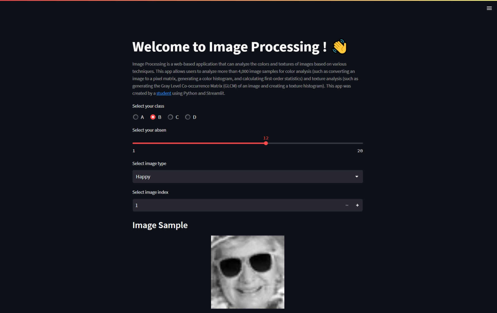

<a name="readme-top"></a>

<!-- ABOUT THE PROJECT -->

# Image Processing



[Image Processing](link) is a web-based application that can analyze the colors and textures of images based on various techniques. This app allows users to analyze more than 4,000 image samples for color analysis (such as converting an image to a pixel matrix, generating a color histogram, and calculating first-order statistics) and texture analysis (such as generating the Gray Level Co-occurrence Matrix (GLCM) of an image and creating a texture histogram).

Use the `README.md` to get started.

<p align="right">(<a href="#readme-top">back to top</a>)</p>

## Built With

- [![Python][python.badge]](https://shields.io/)
- [![Jupyter][jupyter.badge]](https://shields.io/)
- [![Streamlit][streamlit.badge]](https://shields.io/)

<p align="right">(<a href="#readme-top">back to top</a>)</p>

<!-- GETTING STARTED -->

## Installation

1. Clone the repo
   ```sh
   https://github.com/agungmahadana/Image-Processing.git
   ```
2. Build and clean
3. Run the app

<p align="right">(<a href="#readme-top">back to top</a>)</p>

<!-- CONTRIBUTING -->

## Contributing

Contributions are what make the open source community such an amazing place to learn, inspire, and create. Any contributions you make are **greatly appreciated**.

If you have a suggestion that would make this better, please fork the repo and create a pull request. You can also simply open an issue with the tag "enhancement".
Don't forget to give the project a star! Thanks again!

1. Fork the Project
2. Create your Feature Branch (`git checkout -b feature/AmazingFeature`)
3. Commit your Changes (`git commit -m 'Add some AmazingFeature'`)
4. Push to the Branch (`git push origin feature/AmazingFeature`)
5. Open a Pull Request

<p align="right">(<a href="#readme-top">back to top</a>)</p>

<!-- LICENSE -->

## License

Distributed under the MIT License. See [`LICENSE`](LICENSE) for more information.

<p align="right">(<a href="#readme-top">back to top</a>)</p>

<!-- ACKNOWLEDGMENTS -->

## Acknowledgments

- [Python](https://www.python.org/)
- [Jupyter](https://jupyter.org/)
- [Streamlit](https://streamlit.io/)

<p align="right">(<a href="#readme-top">back to top</a>)</p>

<!-- MARKDOWN LINK & IMAGE -->

[python.badge]: https://img.shields.io/badge/python-FFD43B?style=for-the-badge&logo=python
[jupyter.badge]: https://img.shields.io/badge/jupyter-gray?style=for-the-badge&logo=jupyter
[streamlit.badge]: https://img.shields.io/badge/streamlit-FF4B4B?style=for-the-badge&logo=streamlit&logoColor=white